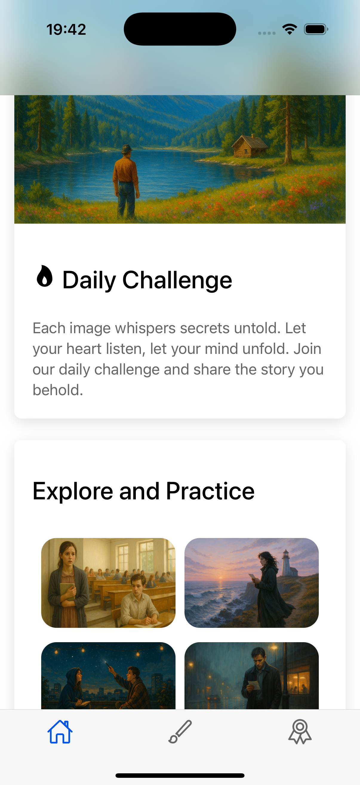
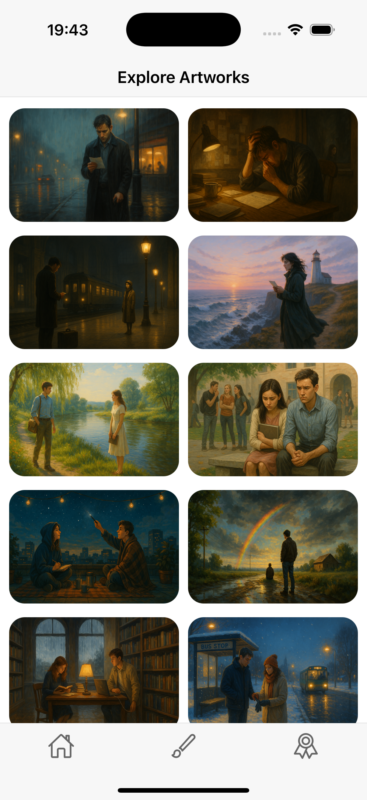
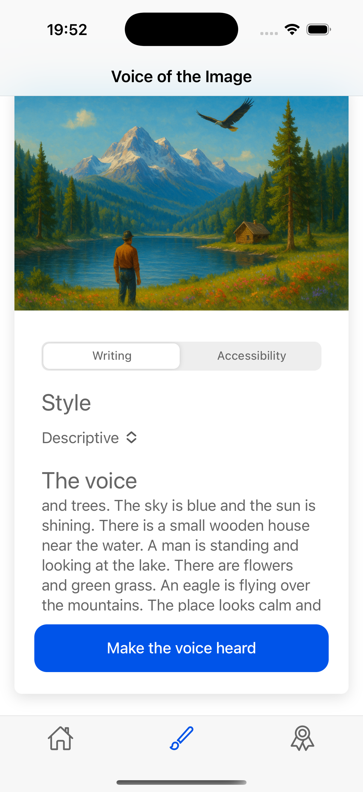
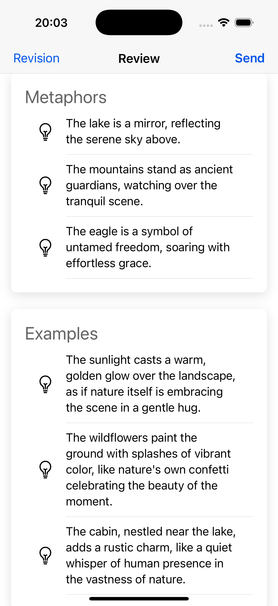
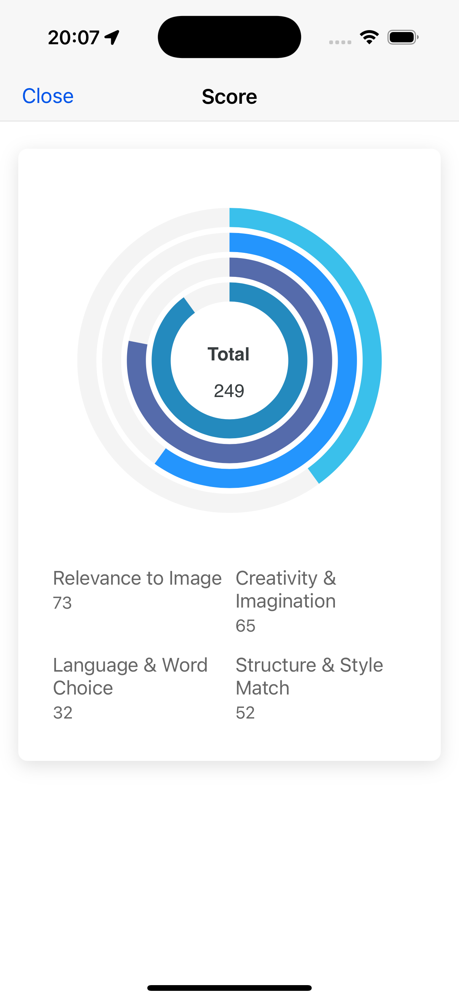
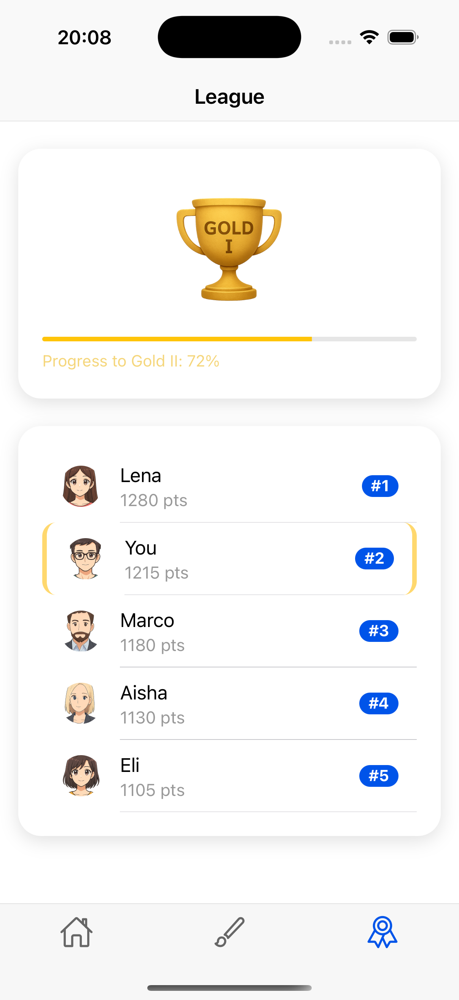

# Luminote App
Luminote is an AI powered app for helping people with improving their skills in writing and describing things around them by leveraging the power of language models.

## Background
I believe that many people struggle with writing and describing things around them, and that this is a skill that can be improved with practice. Luminote is designed to help people improve their writing skills by providing them with a platform to practice and receive feedback.
There is a lot of potential for AI to help people with this, and I believe that Luminote is a step in the right direction.
There is a huge different between saying "A man standing on a rock and looking at the sea" and "A man standing on a rock and looking at the sea, with the sun setting in the background and the waves crashing against the shore with feel of hope and sadness and loneliness in his heart".

## App Features
Daily writing practice with AI feedback
Daily Challenge
League system
Style of writing including: Poetry, short story, humor, narrative, etc.
Accessibility for people with disabilities
Support for multiple languages

## Further Work
Student classroom writing practice
Generate images based on the world hot news or events
Add one word or metaphor to the user's writing skill

## The app workflow

### Home Page
When the user opens the app, they are presented with a home page that shows their daily writing practice and any challenges they have completed. The user can also see their league ranking and any achievements they have unlocked.  

## Explore and Practice
The user can explore different writing styles and practice their writing skills before start the daily challenge. The user can also see their progress and any feedback they have received from the AI.

### Write the voice of the Image
The user can challenge themselves to write a description of an image for everyday challenge. The AI will provide feedback on the user's writing and help them improve their skills.

### AI Feedback
The AI will provide feedback on the user's writing and help them improve their skills. The user can also see their progress and any feedback they have received from the AI.  

AI gives some examples and common metaphors to help the user improve their writing skills. The user can also see their progress and any feedback they have received from the AI.  

### Score the Writing
AI gives a score to the user's writing based on the quality of their writing and the feedback they have received. The user can also see their progress and any feedback they have received from the AI.  

### League System and Ranking
The user can see their league ranking and any achievements they have unlocked. The user can also see their progress and any feedback they have received from the AI.  

## My Dream
People believe that how much they gain from knowing how to write and describe things around them. I believe that Luminote can help people improve their writing skills and become better writers. I hope that Luminote can help people become more confident in their writing and help them express themselves better.
