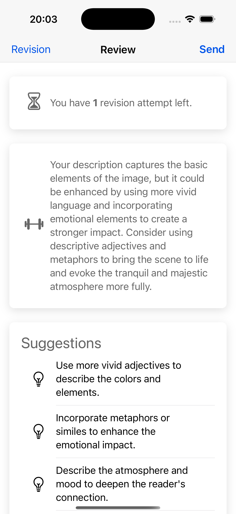

# Luminote App
* Luminote is an AI-powered app that helps people sharpen their writing and descriptive skills, turning everyday moments into vivid stories.  
* Luminote brings people closer to the beauty of art and the richness of the human experience.    
* Luminote connects people to the beauty of art and the wonders of the human world.  
* With Luminote, people can learn how to communicate together with beautiful, thoughtful language.

## Background
* I believe that many people struggle with writing and describing things around them, and that this is a skill that can be improved with practice. Luminote is designed to help people improve their writing skills by providing them with a platform to practice and receive feedback.
* There is a lot of potential for AI to help people with this, and I believe that Luminote is a step in the right direction.
* There is a huge different between saying "A man standing on a rock and looking at the sea" and "A man standing on a rock and looking at the sea, with the sun setting in the background and the waves crashing against the shore with feel of hope and sadness and loneliness in his heart".
* 
## App Features
1. Daily writing practice with AI feedback
2. Daily Challenge
3. League system
4. Style of writing including: Poetry, short story, humor, narrative, etc.
5. Accessibility for people with disabilities
6. Support for multiple languages

## Further Work
1. Student classroom writing practice
2. Generate images based on the world hot news or events
3. Add one word or metaphor to the user's writing skill

## The app workflow

### Home Page
When the user opens the app, they are presented with a home page that shows their daily writing practice and any challenges they have completed. The user can also see their league ranking and any achievements they have unlocked.  

## Explore and Practice
The user can explore different writing styles and practice their writing skills before start the daily challenge. The user can also see their progress and any feedback they have received from the AI.

### Write the voice of the Image
The user can challenge themselves to write a description of an image for everyday challenge. The AI will provide feedback on the user's writing and help them improve their skills.

### AI Feedback
The AI will provide feedback on the user's writing and help them improve their skills.   

AI gives some examples and common metaphors to help the user improve their writing skills.   

### Score the Writing
AI gives a score to the user's writing based on the quality of their writing and the feedback they have received. The user can also see their progress and any feedback they have received from the AI.  

### League System and Ranking
The user can see their league ranking and any achievements they have unlocked. 

## My Dream
Many people believe in the power of the arts and in the deep connection that comes from truly understanding one another. At the heart of being human is our ability to express love, ideas, and feelings through words. With Luminote, people can learn how to communicate together with beautiful, thoughtful language.  

We gain so much from knowing how to write and describe the world around us — from capturing the colors of a sunset to sharing the quiet strength of a friend’s smile. I believe Luminote can help people not only improve their writing skills, but also grow into more confident, compassionate communicators.  

By using this app, we nurture both the art of language and the love between human beings, learning to connect more deeply, share more openly, and see the beauty in each other’s stories.  
